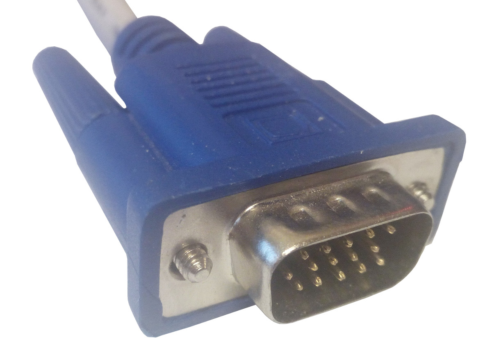
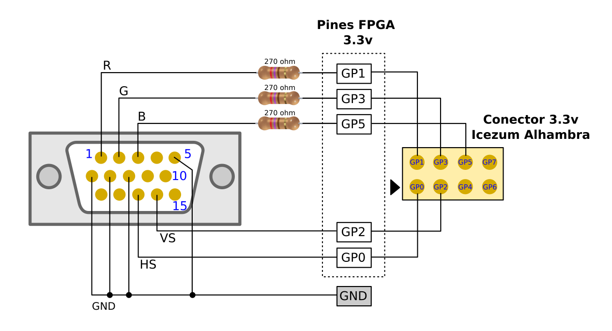

# MonsterLED

Controlador VGA simple para **FPGAs Libres**. Convierte tu **pantalla VGA** en un **LED gigante** :-)

En esta **animación** se puede ver el **MonsterLED** en acción. La **salida digital de 1 bit** de un **sensor de infrarrojos** se muestra por la pantalla. Cuando se acerca el papel, el sensor devuelve **0** y la pantalla se pone **negra**. Cuando detecta un objeto devuelve **1** y la pantalla se pone **roja**

## Materiales necesarios

* 1 [Icezum Alhambra](https://github.com/FPGAwars/icezum/wiki) board o placa con FPGA libre compatible
* 3 Resistencias de 270 ohm (de 1/4 W)
* 1 Conector hembra VGA para circuito impreso (opcional)
* 1 pantalla VGA

## Conexión de la FPGA a la VGA

Los **monitores VGA** tienen de salida un **conector macho de 15 pines**, agrupados en 3 filas de 5

De todos ellos, sólo nos interesan **6**:

* **R**,**G**,**B** : (Red, Green, Blue) Son los 3 pines por donde entra una señal analógica de 75ohm y 0.7v, que representa los 3 colores: rojo, verde y azul.
* **HS**: Señal digital de sincronismo horizontal (Horizontal Sync)
* **VS**: Señal digital de sincronismo vertical (Vertical Sync)
* **GND**: Masa

Esta es la disposición en el **conector VGA**:

La conexión con la FPGA se hace a través de los pines de **3.3v**, que en la tarjeta **Icezum Alhambra** son los pines del **conector amarillo** (denotados por **GPx** en Icestudio)

El **esquema de conexionado** es el siguiente:

-------------

### Conexión con cables hembra-hembra

(Conexión con cables hembra - hembra)

### conexión a través de placa de entrenamiento (Breadboard)

(conexión física con cables macho-hembra y breadboar)

### Conexión con PCB propio

(Conexión con PCB propio)  

## Credits
I have based this work on the information available in the [Pong project](http://www.fpga4fun.com/PongGame.html) from **FPGA4fun**
